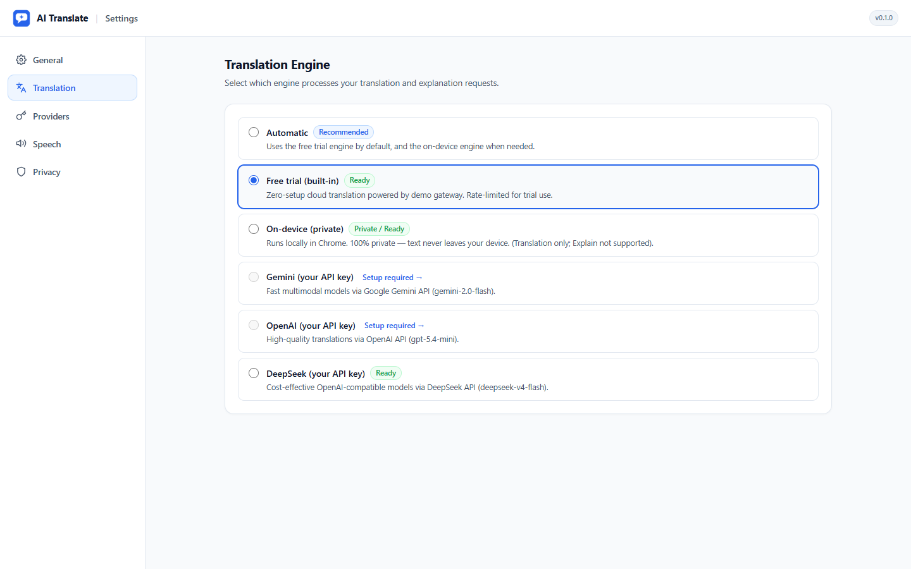
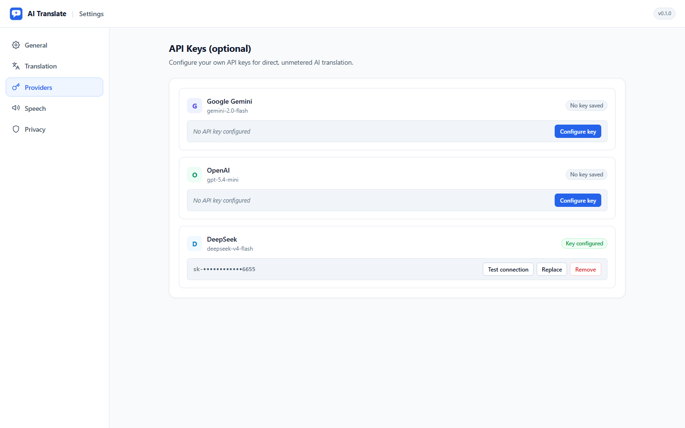
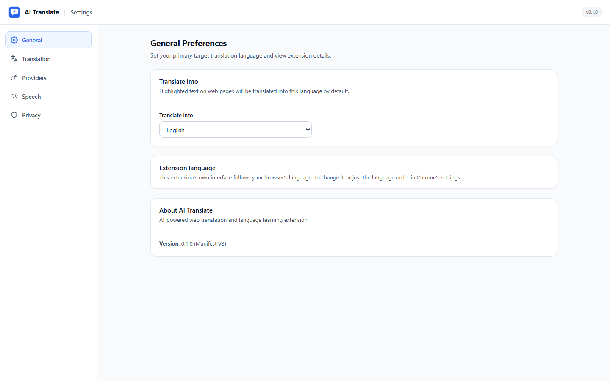
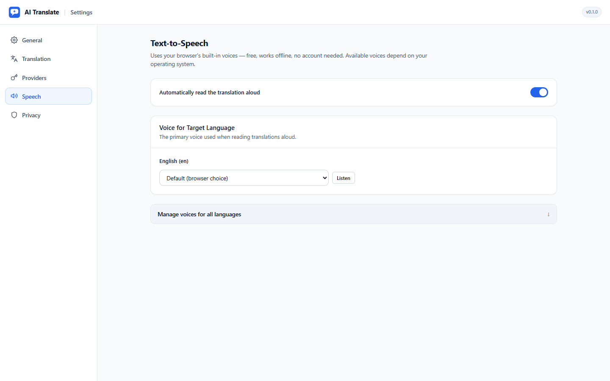
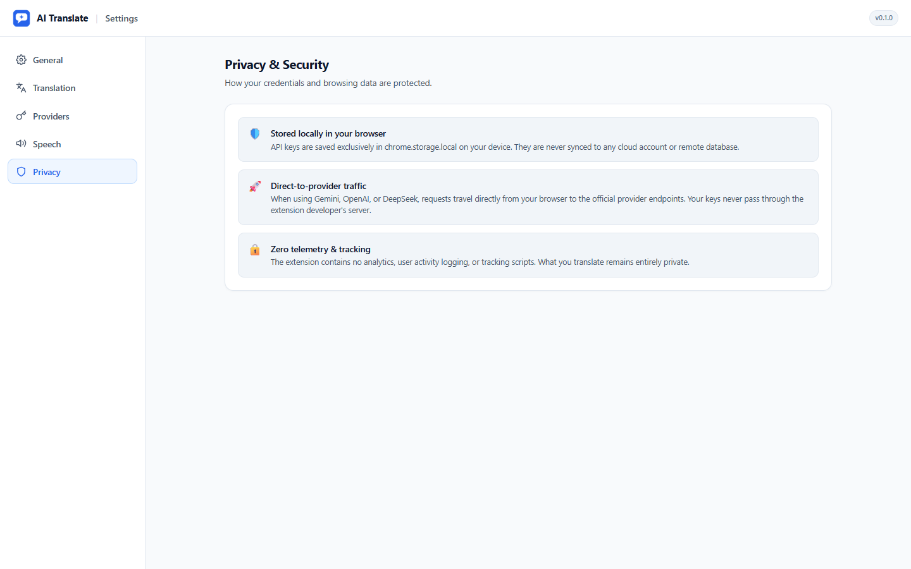
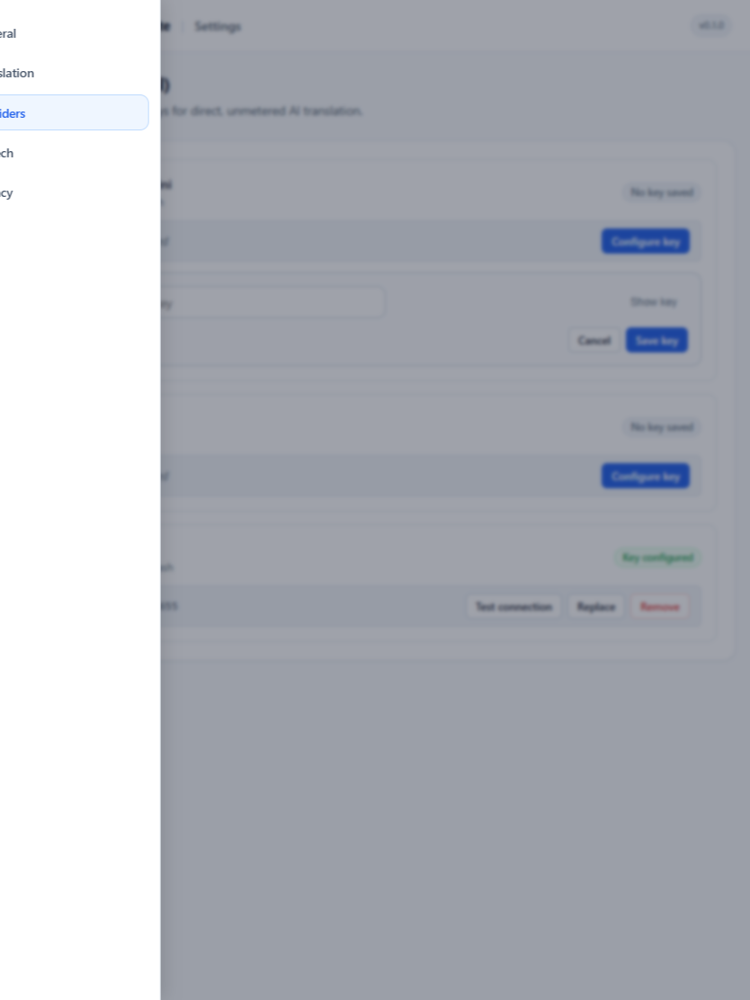

<p align="center">
  
</p>

<h1 align="center">AI Translate Browser Extension</h1>

<p align="center">
  <strong>Next-generation in-page translation and language learning assistant powered by AI.</strong><br />
  Select text on any webpage → floating trigger icon appears → click for fluent translation + CEFR-graded word explanations.
</p>

<p align="center">
  <a href="https://github.com"></a>
  <a href="https://github.com"></a>
  <a href="https://github.com"></a>
  <a href="https://github.com"></a>
  <a href="LICENSE"></a>
</p>

---

## ✨ Highlights & Key Features

- 🎯 **Icon-First Selection UX**: Non-intrusive floating trigger icon appears near text selections; no annoying auto-popups that break browsing.
- 🧠 **CEFR-Graded "Explain" Panel**: Expandable language-tutor breakdown with phonetic IPA, part-of-speech badges, dual-language definitions, progressive difficulty examples (A2 → B1 → B2), collocations, word families, synonyms, and mnemonics.
- ⚡ **Multi-Engine Ecosystem**:
  - **Free Demo Gateway (Default)**: Zero-setup cloud translation out of the box with origin-checked session tokens.
  - **On-Device (Chrome Built-in AI)**: 100% private on-device translation using Chrome 138+ desktop APIs — text never leaves your device.
  - **Bring-Your-Own-Key (BYOK)**: Connect your own API keys for **Google Gemini**, **OpenAI**, or **DeepSeek** with zero proxying through developer servers.
- 🔊 **Native Text-to-Speech (TTS)**: Uses system speech synthesis for natural pronunciation, per-target-language voice pickers, and live voice auditioning.
- 🖥️ **Product-Grade Settings V2 App Shell**: True single-page settings architecture with a persistent topbar, desktop sidebar navigation, compact engine selectors, masked API credentials, and an adaptive mobile drawer.
- 🔒 **Privacy-by-Design**: Content scripts never touch API keys or make external network calls. All credentials remain in local browser sandbox (`chrome.storage.local`). Zero analytics, zero telemetry.

---

## 📸 Screenshots

| Translation & Settings Shell | Providers (BYOK) Management |
| :---: | :---: |
|  |  |

| General Preferences | Text-to-Speech & Voice Preview |
| :---: | :---: |
|  |  |

| Privacy & Trust Pillars | Responsive Drawer (Mobile/Tablet) |
| :---: | :---: |
|  |  |

---

## 🚀 Quick Install (For Users)

You can install AI Translate in under 1 minute without needing any build tools:

1. Go to the [**Releases**](../../releases) tab and download the latest `ai-translate-extension-v*.zip`.
2. Unzip the downloaded file to a local folder.
3. Open Google Chrome (or Edge / Brave) and navigate to:
   ```text
   chrome://extensions
   ```
4. Toggle on **Developer mode** in the top right corner.
5. Click **Load unpacked** (加载已解压的扩展程序) in the top left and select the unzipped folder.
6. Done! Select text on any web page to start translating.

---

## 💻 Quick Start (For Developers)

### Prerequisites
- Node.js 20+
- Google Chrome or Chromium-based browser

### 1. Clone and Install
```bash
git clone https://github.com/your-username/AI-Translate-Browser-Extension.git
cd AI-Translate-Browser-Extension
npm install
```

### 2. Development Mode (Live Reload)
```bash
npm run dev
```
Load the `dist/` directory as an unpacked extension at `chrome://extensions`.

### 3. Production Build & Linters
```bash
npm run lint          # ESLint static code verification
npm run lint:i18n     # Parity & hardcoded string checks across all 6 locales
npm run build         # Vite + CRXJS production build into dist/
```

### 4. Automated UI & Responsive Verification
```bash
node scripts/verify-options-v2.mjs
```
Runs an automated headless Chrome DevTools Protocol (CDP) test suite verifying all 5 routes, responsive layouts (1440px / 834px / 390px), and security assertions.

---

## 🏛️ Architecture & Security Model

```text
┌─────────────────────────────────────────────────────────────┐
│ Web Page DOM                                                │
│  ┌────────────────────────────────────────────┐              │
│  │ CONTENT SCRIPT (src/content/)              │              │
│  │ - Selection detector & bounding box        │              │
│  │ - Shadow DOM host (ai-translate-host)      │              │
│  │ - Trigger icon & modal dialog              │              │
│  │ - NO network traffic, NO API keys          │              │
│  └───────────────▲────────────────────────────┘              │
└──────────────────│───────────────────────────────────────────┘
        chrome.runtime.sendMessage / onMessage
┌──────────────────▼───────────────────────────────────────────┐
│ SERVICE WORKER (src/background/)                             │
│ - Engine Adapters (Demo / On-device / Gemini / OpenAI / DS)   │
│ - API Keys (chrome.storage.local, never sent to content)     │
│ - IndexedDB cache with LRU eviction                           │
│ - Error Mapper (normalized EngineError codes)                │
└──────▲───────────────────▲──────────────────────▲────────────┘
       │                   │                      │
┌──────▼──────┐      ┌─────▼───────┐       ┌──────▼─────────────┐
│ POPUP       │      │ OPTIONS V2  │       │ OFFSCREEN DOCUMENT │
│ Quick toggle│      │ True App    │       │ Hosts Chrome       │
│ & status    │      │ Shell (SPA) │       │ Translator AI API  │
└─────────────┘      └─────────────┘       └────────────────────┘
```

- **Content Isolation**: Content scripts operate within an open Shadow DOM root with strict CSS resets to guarantee host page styles never collide with extension widgets.
- **Direct-to-Provider BYOK**: When configuring Gemini, OpenAI, or DeepSeek, API requests are dispatched directly from the service worker to the provider's official endpoints. The developer server never proxies or stores user keys.
- **Zero Remote Code**: 100% compliant with Manifest V3 security standards. No `eval`, no CDN dependencies, and no dynamically loaded remote scripts.

---

## 🌐 Supported Locales

The extension interface is natively localized in 6 languages (Chrome auto-detects your browser locale):

| Code | Language | Native Name |
|---|---|---|
| `en` | English | English (Default) |
| `zh_CN` | Chinese (Simplified) | 简体中文 |
| `ja` | Japanese | 日本語 |
| `ko` | Korean | 한국어 |
| `ms` | Malay | Bahasa Melayu |
| `vi` | Vietnamese | Tiếng Việt |

---

## 📚 Documentation Index

For in-depth development guides and architectural specifications:

| Document | Purpose |
|---|---|
| [SPEC.md](SPEC.md) | Product specification and requirements contract. |
| [docs/ARCHITECTURE.md](docs/ARCHITECTURE.md) | Component boundary, message protocol, and lifetime handling. |
| [docs/ENGINES.md](docs/ENGINES.md) | Integration notes for Demo, Chrome On-device, Gemini, OpenAI, and DeepSeek. |
| [docs/CODING-STANDARDS.md](docs/CODING-STANDARDS.md) | Code quality, JSDoc, error handling, and convention rules. |
| [docs/I18N.md](docs/I18N.md) | Guidelines for managing localized strings and placeholders. |
| [docs/store/PRIVACY-POLICY.md](docs/store/PRIVACY-POLICY.md) | Canonical Privacy Policy and data disclosures. |
| [docs/store/SUBMISSION-NOTES.md](docs/store/SUBMISSION-NOTES.md) | Developer Dashboard justifications and store listing notes. |

---

## 📄 License

Distributed under the MIT License. See [LICENSE](LICENSE) for more information.
Free for both personal and commercial use.
